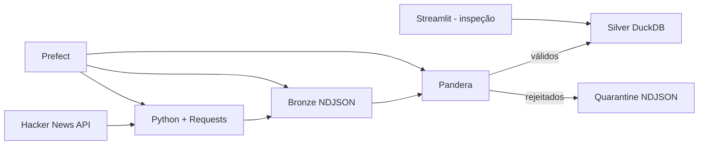

# Hacker News Trends

Pipeline de Engenharia de Dados para monitoramento e detecção de tendências tecnológicas a partir da API pública do Hacker News.

## Status atual

Nesta primeira etapa estão implementados:

- ingestão de `topstories` e detalhes de cada item;
- Bronze em NDJSON, preservando o payload original;
- particionamento da Bronze por ano/mês/dia;
- validação da Silver com Pandera;
- quarentena para registros rejeitados;
- Silver persistida em DuckDB;
- orquestração básica com Prefect e retries na coleta;
- testes básicos com pytest;
- Streamlit apenas para inspeção da etapa atual;
- Docker e Docker Compose;
- workflow básico de testes no GitHub Actions.

A camada Gold e o dashboard analítico final ainda não fazem parte desta versão.

## Arquitetura atual



## Estrutura

```text
.
├── app.py
├── src/
│   ├── ingestion/
│   ├── bronze/
│   ├── silver/
│   ├── quality/
│   ├── orchestration/
│   └── config.py
├── tests/
├── data/
│   ├── bronze/
│   └── quarantine/
├── logs/
├── docs/
├── Dockerfile
├── docker-compose.yml
├── requirements.txt
└── .env.example
```

## Execução local

```bash
python -m venv .venv
```

Linux/macOS:

```bash
source .venv/bin/activate
```

Windows PowerShell:

```powershell
.venv\Scripts\Activate.ps1
```

Instale as dependências:

```bash
pip install -r requirements.txt
```

Crie o arquivo de ambiente:

Linux/macOS:

```bash
cp .env.example .env
```

Windows PowerShell:

```powershell
Copy-Item .env.example .env
```

Execute a pipeline uma vez:

```bash
python -m src.orchestration.pipeline_flow
```

Execute a interface de inspeção:

```bash
streamlit run app.py
```

## Docker

Crie `.env` a partir de `.env.example` e execute:

```bash
docker compose up --build
```

Acesse o Streamlit em `http://localhost:8501`.

Para executar apenas uma coleta em um container:

```bash
docker compose --profile pipeline run --rm pipeline
```

## Testes

```bash
pytest -q
```

## Dados

A Bronze é armazenada em:

```text
data/bronze/hacker_news/year=YYYY/month=MM/day=DD/
```

A Silver é persistida no arquivo:

```text
data/hacker_news.duckdb
```

Tabela atual:

```text
silver.story_snapshots
```

A chave lógica é:

```text
snapshot_id + story_id + list_type
```

Isso permite reprocessar o mesmo arquivo Bronze sem duplicar a mesma observação na Silver.
