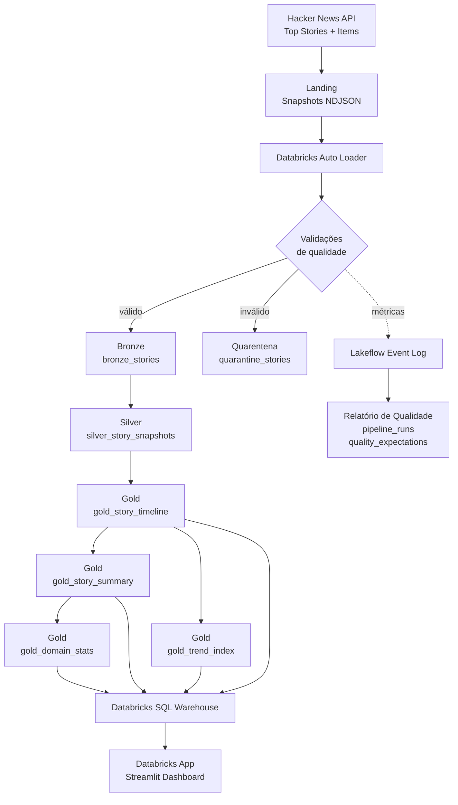
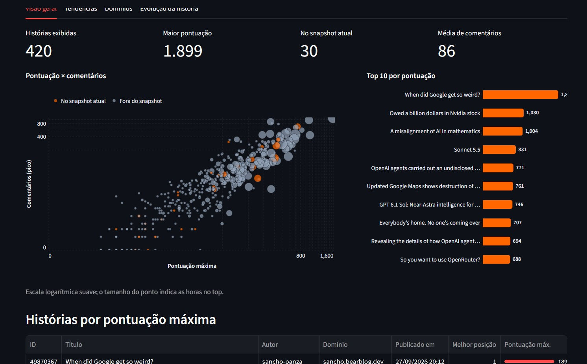
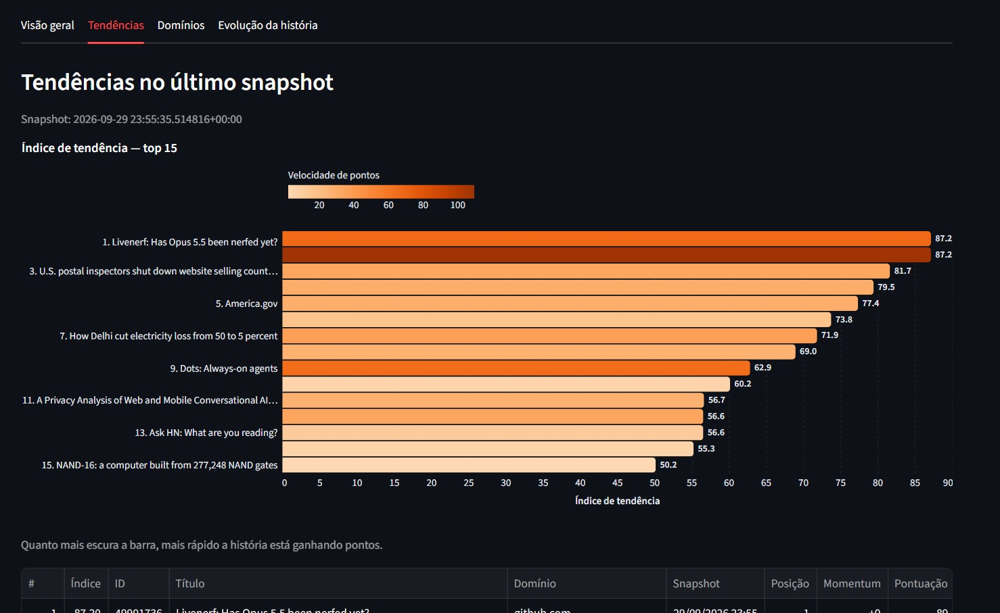
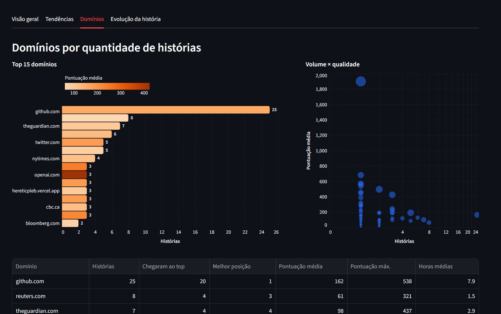
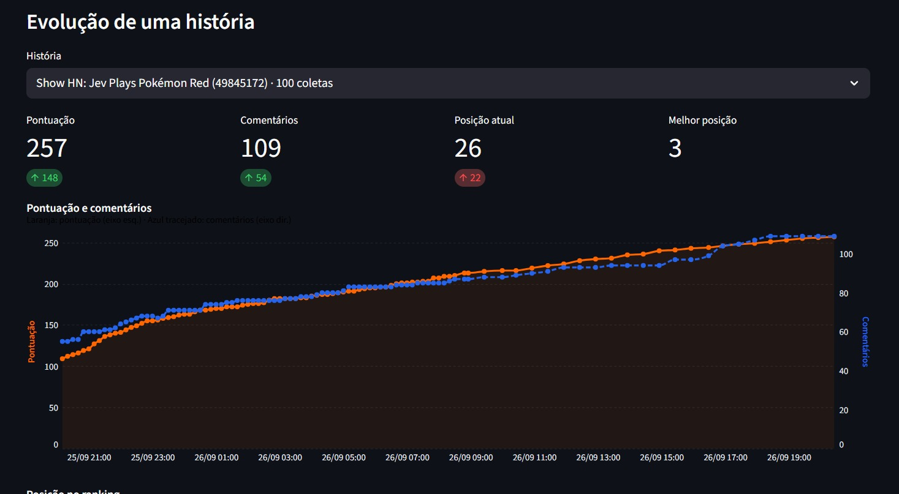
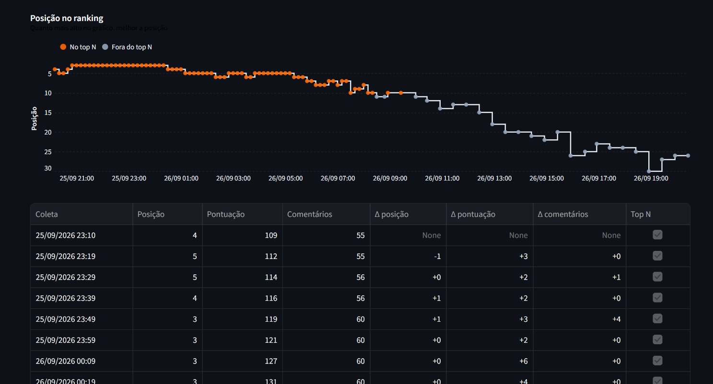

# 📈 Pipeline de Monitoramento e Detecção de Tendências Tecnológicas no Hacker News

Projeto desenvolvido para a disciplina de **Projetos** da Pós-Graduação em **Engenharia de Dados da UNIFOR**.

O projeto implementa uma pipeline de Engenharia de Dados ponta a ponta para coletar periodicamente as principais histórias do Hacker News, preservar sua evolução histórica e transformar os snapshots coletados em indicadores analíticos de desempenho, relevância e tendência.

A solução é executada sobre o **Databricks**, utilizando arquitetura medalhão, processamento incremental, validações de qualidade, quarentena de registros inválidos, orquestração automatizada e uma aplicação Streamlit para consumo dos dados.

---

## 🎯 Objetivo

O Hacker News apresenta continuamente histórias que sobem e descem no ranking conforme recebem votos e comentários.

Observar apenas o estado atual das histórias não permite responder perguntas como:

- quais notícias estão crescendo mais rapidamente;
- quais histórias ganharam ou perderam posições;
- quanto tempo uma notícia permaneceu entre as primeiras posições;
- quais fontes aparecem com maior frequência;
- quais domínios combinam maior volume e melhor desempenho;
- como score e comentários evoluíram ao longo do tempo;
- quais histórias apresentam maior tendência de crescimento no momento.

O projeto resolve esse problema armazenando **snapshots periódicos do ranking**.

Uma mesma história pode, portanto, ser observada diversas vezes:

```text
10:00 → posição 18 → 52 pontos → 14 comentários
10:30 → posição 11 → 81 pontos → 23 comentários
11:00 → posição  6 → 126 pontos → 41 comentários
```

A partir desse histórico, a pipeline calcula métricas de evolução, permanência, velocidade, desempenho e tendência.

---

# 🗂️ Fonte de dados

A fonte utilizada é a **API pública oficial do Hacker News**, disponibilizada através do Firebase.

Os principais endpoints utilizados são:

```text
/v0/topstories.json
/v0/item/{id}.json
```

O primeiro endpoint retorna os identificadores das histórias presentes no ranking de Top Stories.

Para cada identificador selecionado, o segundo endpoint é consultado para obter os detalhes da história.

A aplicação coleta atualmente as **30 primeiras histórias do ranking** a cada execução.

A API é pública e não exige API Key.

---

# 🏗️ Arquitetura da solução

A solução utiliza uma arquitetura baseada no padrão **Medallion Architecture**, separando os dados por nível de tratamento e finalidade.


```mermaid
flowchart TD
    API["Hacker News API<br/>Top Stories + Items"]

    API --> LANDING["Landing<br/>Snapshots NDJSON"]

    LANDING --> AUTO["Databricks Auto Loader"]

    AUTO --> QUALITY{"Validações<br/>de qualidade"}

    QUALITY -->|válido| BRONZE["Bronze<br/>bronze_stories"]
    QUALITY -->|inválido| QUARANTINE["Quarentena<br/>quarantine_stories"]

    BRONZE --> SILVER["Silver<br/>silver_story_snapshots"]

    SILVER --> TIMELINE["Gold<br/>gold_story_timeline"]

    TIMELINE --> SUMMARY["Gold<br/>gold_story_summary"]
    TIMELINE --> TREND["Gold<br/>gold_trend_index"]
    SUMMARY --> DOMAIN["Gold<br/>gold_domain_stats"]

    TIMELINE --> WAREHOUSE["Databricks SQL Warehouse"]
    SUMMARY --> WAREHOUSE
    TREND --> WAREHOUSE
    DOMAIN --> WAREHOUSE

    WAREHOUSE --> APP["Databricks App<br/>Streamlit Dashboard"]

    QUALITY -. métricas .-> EVENTLOG["Lakeflow Event Log"]
    EVENTLOG --> REPORT["Relatório de Qualidade<br/>pipeline_runs<br/>quality_expectations"]
```

O fluxo operacional é executado automaticamente pelo **Lakeflow Job**:

```text
Schedule — a cada 30 minutos
        ↓
Hacker News Pipeline
        ↓
01_landing.py
        ↓
Snapshot NDJSON
        ↓
Lakeflow ETL Pipeline
        ↓
Bronze / Quarentena
        ↓
Silver
        ↓
Gold
        ↓
SQL Warehouse
        ↓
Dashboard
```

---

# ⚙️ Componentes da arquitetura

## Landing

A camada Landing preserva os dados coletados da API o mais próximo possível de sua estrutura original.

Cada execução da pipeline gera um novo arquivo no formato **NDJSON**, em que cada linha corresponde a uma história observada naquele snapshot.

Os arquivos são armazenados no Unity Catalog Volume:

```text
/Volumes/hackernews/hacker_news/data/landing
```

A organização segue a data da coleta:

```text
landing/
└── AAAA/
    └── MM/
        └── DD/
            └── hacker_news_HHMMSS.ndjson
```

Exemplo:

```text
landing/2026/09/29/hacker_news_203000.ndjson
```

Os snapshots não são sobrescritos. Essa decisão é essencial para o projeto, pois permite reconstruir a evolução histórica das histórias.

---

## Bronze

A camada Bronze transforma os arquivos da Landing em dados estruturados.

A ingestão utiliza o **Databricks Auto Loader**, permitindo que apenas arquivos ainda não processados sejam considerados nas execuções seguintes.

Nesta etapa são realizadas operações como:

- leitura incremental;
- parsing do JSON;
- flatten do objeto retornado pela API;
- padronização dos campos;
- enriquecimento com metadados;
- validações de qualidade.

Registros aprovados são enviados para:

```text
hackernews.hacker_news.bronze_stories
```

Registros que não atendem às regras de qualidade seguem para:

```text
hackernews.hacker_news.quarantine_stories
```

Com isso, dados inválidos não contaminam as camadas seguintes e também não são simplesmente descartados.

---

## Silver

A Silver representa o histórico limpo, tipado e padronizado das histórias.

Tabela:

```text
hackernews.hacker_news.silver_story_snapshots
```

Sua granularidade é:

```text
1 linha = 1 história em 1 snapshot
```

A chave lógica é:

```text
story_id + collected_at
```

Uma mesma história pode aparecer diversas vezes, desde que observada em horários diferentes.

Isso torna possível comparar sua posição, pontuação e quantidade de comentários ao longo do tempo.

Nesta camada também são realizadas:

- seleção das colunas relevantes;
- tipagem explícita;
- normalização de strings;
- deduplicação;
- validações após conversões de tipo;
- inclusão de metadados de auditoria.

---

# 🥇 Camada Gold

A camada Gold contém os produtos analíticos consumidos diretamente pela aplicação.

São utilizadas quatro Materialized Views:

```text
gold_story_timeline
gold_story_summary
gold_domain_stats
gold_trend_index
```

---

## `gold_story_timeline`

Granularidade:

```text
1 história × 1 snapshot
```

A tabela compara cada observação com a observação anterior da mesma história.

Permite analisar:

- evolução do ranking;
- evolução da pontuação;
- evolução dos comentários;
- velocidade de crescimento;
- idade da história;
- permanência no Top 10;
- continuidade entre snapshots.

É a principal fonte da aba **Evolução da história**.

---

## `gold_story_summary`

Granularidade:

```text
1 linha por história
```

Resume todo o período em que uma história foi observada.

Entre as métricas calculadas estão:

- primeira e última aparição;
- número de snapshots;
- melhor posição alcançada;
- posição inicial e final;
- score inicial, máximo e final;
- comentários iniciais, máximos e finais;
- ganho de score;
- ganho de comentários;
- horas no ranking;
- horas no Top 10;
- crescimento médio por hora.

Essa tabela alimenta principalmente a **Visão geral** da dashboard.

---

## `gold_domain_stats`

Granularidade:

```text
1 linha por domínio
```

Agrega as histórias de acordo com seu domínio de origem.

Permite avaliar tanto **volume** quanto **desempenho** das fontes.

Entre as métricas estão:

- quantidade de histórias;
- quantidade de histórias que chegaram ao Top 10;
- melhor posição alcançada;
- pontuação máxima;
- pontuação máxima média;
- comentários médios;
- tempo médio no ranking.

Posts que não possuem link externo, como alguns conteúdos do próprio Hacker News, são agrupados como:

```text
(post sem link)
```

---

## `gold_trend_index`

Granularidade:

```text
1 linha por história presente no snapshot mais recente
```

Essa tabela contém o **Índice de Tendência**, criado para representar quais histórias estão ganhando maior relevância no momento.

A análise considera uma janela recente de:

```text
6 horas
```

Quatro componentes são utilizados:

| Componente | Peso | Significado |
|---|---:|---|
| Velocidade de score | 40% | Pontuação obtida em relação à idade da história |
| Velocidade de comentários | 25% | Comentários em relação à idade da história |
| Momentum de ranking | 20% | Evolução da posição dentro da janela recente |
| Posição atual | 15% | Valoriza histórias atualmente melhor posicionadas |

Cada componente é normalizado entre `0` e `1` utilizando sua posição relativa entre as histórias do snapshot.

O índice final segue conceitualmente:

```text
Índice de Tendência =
100 × (
    0.40 × velocidade_score_normalizada
  + 0.25 × velocidade_comentarios_normalizada
  + 0.20 × momentum_ranking_normalizado
  + 0.15 × posicao_atual_normalizada
)
```

O resultado varia aproximadamente entre:

```text
0 ─────────────────────────── 100
menor tendência          maior tendência
```

Para evitar velocidades artificialmente elevadas em histórias publicadas há poucos minutos, é considerada uma idade mínima de **1 hora** nos cálculos de velocidade.

> O Índice de Tendência é um indicador descritivo do momento atual. Ele não representa uma previsão de que determinada história permanecerá ou chegará ao topo do ranking.

---

# 🔧 Decisões técnicas

| Decisão | Justificativa |
|---|---|
| API oficial do Hacker News | Fonte pública, estruturada e diretamente relacionada ao problema |
| Snapshots periódicos | Permitem transformar um ranking momentâneo em uma série histórica |
| Coleta das Top 30 | Mantém o escopo adequado enquanto preserva as histórias de maior relevância |
| Execução a cada 30 minutos | Cria resolução temporal suficiente para observar mudanças sem coleta excessiva |
| NDJSON na Landing | Formato simples, adequado para snapshots e ingestão incremental |
| Unity Catalog | Centraliza Volume, tabelas, views, permissões e governança |
| Arquitetura Medalhão | Separa ingestão, qualidade, tratamento e consumo |
| Auto Loader | Permite ingestão incremental de novos arquivos |
| Lakeflow Declarative Pipelines | Gerencia dependências, estado incremental, Expectations e materializações |
| Quarentena | Mantém registros inválidos disponíveis para análise sem contaminar a Bronze |
| Silver histórica | Mantém uma observação por história e snapshot |
| Materialized Views na Gold | As métricas dependem do histórico completo e precisam ser recalculadas de forma consistente |
| Lakeflow Jobs | Automatiza e orquestra a execução ponta a ponta |
| SQL Warehouse | Desacopla a camada de consumo do processamento da pipeline |
| Streamlit | Permite transformar as tabelas Gold em uma aplicação analítica interativa |
| Databricks Asset Bundles | Permite versionar e reproduzir a infraestrutura definida no `databricks.yml` |
| Git + GitHub | Versionamento e rastreabilidade de código, configuração e documentação |

---

# 📊 Dashboard

A camada de consumo é uma aplicação **Streamlit executada como Databricks App**.

O aplicativo consulta diretamente as tabelas da camada Gold através do:

```text
Hacker News SQL Warehouse
```

A dashboard está organizada em quatro abas.

---

## 1. Visão geral

Apresenta uma visão consolidada das histórias coletadas.

Entre os indicadores estão:

- quantidade de histórias;
- maior pontuação observada;
- quantidade de histórias presentes no snapshot atual;
- média de comentários.

A principal visualização cruza:

```text
Pontuação máxima × Comentários
```

permitindo identificar histórias com diferentes níveis de engajamento.

Também é apresentado o ranking das histórias com maior pontuação.





---

## 2. Tendências

Apresenta as **15 histórias com maior Índice de Tendência** no snapshot mais recente.

O gráfico permite visualizar rapidamente quais histórias estão ganhando força segundo o indicador desenvolvido pelo projeto.

Além do índice, podem ser analisados:

- posição atual;
- momentum no ranking;
- velocidade de pontuação;
- quantidade de comentários;
- domínio da publicação.





---

## 3. Domínios

Analisa as fontes externas mais presentes entre as histórias coletadas.

A aba apresenta:

- Top 15 domínios por quantidade de histórias;
- quantidade de histórias que alcançaram o Top 10;
- pontuação média;
- pontuação máxima;
- tempo médio no ranking;
- comparação entre volume e qualidade/desempenho.

Isso permite diferenciar fontes que aparecem frequentemente de fontes que, mesmo aparecendo menos, costumam obter grande engajamento.





---

## 4. Evolução da história

Permite selecionar individualmente uma história e visualizar seu comportamento durante os snapshots coletados.

São exibidas evoluções de:

```text
Pontuação
Comentários
Posição no ranking
```

Também são apresentados indicadores como:

- pontuação atual e variação;
- comentários e variação;
- posição atual;
- melhor posição alcançada.

Essa visão demonstra diretamente a principal característica do projeto: utilizar snapshots para transformar o ranking do Hacker News em dados históricos.






---

# ▶️ Como visualizar a aplicação

Esta seção considera que o ambiente Databricks já está completamente configurado e que a pipeline já possui dados.

Para instruções de instalação, provisionamento, reprodução da infraestrutura ou configuração manual, consulte:

```text
RUNBOOK.md
```

Para abrir a dashboard:

```text
Databricks
   ↓
Apps
   ↓
hackernews
   ↓
Start / Deploy
   ↓
Open App
```

Após a inicialização, abra o endereço disponibilizado pelo Databricks.

O aplicativo já está configurado para utilizar o **Hacker News SQL Warehouse** e consultar as tabelas Gold.

Caso a aplicação não consiga iniciar ou consultar os dados, consulte o procedimento de diagnóstico disponível no `RUNBOOK.md`.

---

# ✅ Qualidade de dados

A qualidade dos dados é aplicada durante o processamento da pipeline.

Entre as verificações realizadas estão:

- identificador obrigatório;
- identificador válido;
- consistência entre o ID solicitado e o item retornado;
- data de coleta válida;
- posição no ranking válida;
- título obrigatório;
- score não negativo;
- quantidade de comentários não negativa;
- data de publicação válida;
- origem esperada;
- tipo de lista esperado;
- validação do tipo do item;
- tratamento de itens mortos ou removidos;
- validação do schema;
- validação do JSON.

O fluxo de qualidade segue:

```text
Registro
   ↓
Validações
   ↓
┌────────────────────┐
│                    │
▼                    ▼
Válido              Inválido
│                    │
▼                    ▼
Bronze          Quarentena
```

Na Silver existem ainda validações posteriores à tipagem para garantir que campos essenciais continuem válidos após as conversões.

---

# 📋 Monitoramento e relatório de qualidade

O **Lakeflow Declarative Pipelines** registra automaticamente eventos de execução no Event Log:

```text
hackernews.hacker_news.pipeline_event_log
```

O notebook:

```text
notebooks/03_quality_report.sql
```

cria duas views para simplificar o acompanhamento dessas informações:

```text
hackernews.hacker_news.pipeline_runs
hackernews.hacker_news.quality_expectations
```

### `pipeline_runs`

Permite acompanhar o histórico das execuções, incluindo informações como:

- início e fim;
- status;
- registros processados;
- registros válidos;
- registros enviados para quarentena;
- percentual de registros válidos.

### `quality_expectations`

Apresenta os resultados das regras de qualidade executadas pelo Lakeflow, incluindo:

- regra avaliada;
- dataset;
- quantidade processada;
- registros aprovados;
- registros reprovados;
- percentual de sucesso.

Dessa forma, as validações são **executáveis e auditáveis**, e não apenas regras documentadas.

---

# 📚 Dicionário de dados

## Dados provenientes da API do Hacker News

Os itens retornados pela API podem conter os seguintes campos relevantes para o projeto:

| Campo da API | Descrição | Utilização no projeto |
|---|---|---|
| `id` | Identificador único do item | Origina `story_id` |
| `by` | Usuário autor da publicação | Origina `author` |
| `time` | Data/hora de publicação em Unix Time | Convertido para `published_at` |
| `title` | Título da história | Mantido como `title` |
| `url` | Link externo da história | Mantido como `url` |
| `score` | Pontuação da história | Utilizado nas análises de crescimento e tendência |
| `descendants` | Quantidade total de comentários | Convertido para `comments` |
| `type` | Tipo do item | Utilizado nas validações |
| `text` | Conteúdo textual quando aplicável | Preservado nas primeiras etapas |
| `kids` | IDs dos comentários filhos | Preservado na origem, mas não necessário para as análises atuais |
| `deleted` | Indica item removido | Utilizado nas validações |
| `dead` | Indica item considerado morto | Utilizado nas validações |

---

## Landing

Cada linha do arquivo NDJSON possui a estrutura lógica:

| Campo | Descrição |
|---|---|
| `collected_at` | Data e hora em que o snapshot foi coletado |
| `source` | Identificação da fonte de dados |
| `list_type` | Lista consultada, atualmente `topstories` |
| `rank` | Posição da história na lista no momento da coleta |
| `story_id` | Identificador da história |
| `item` | Objeto original retornado pelo endpoint `/item/{id}.json` |

A Landing mantém o objeto `item` completo para preservar a informação original recebida da fonte.

---

## Bronze — `bronze_stories`

| Campo | Descrição |
|---|---|
| `record_key` | Identificador único do registro coletado |
| `collected_at` | Momento da coleta |
| `source` | Fonte dos dados |
| `list_type` | Tipo de ranking coletado |
| `rank` | Posição da história no snapshot |
| `story_id` | ID da história no Hacker News |
| `title` | Título |
| `author` | Autor |
| `url` | URL externa |
| `domain` | Domínio extraído da URL |
| `text` | Conteúdo textual quando disponível |
| `score` | Pontuação no momento da coleta |
| `comments` | Total de comentários no momento da coleta |
| `published_at` | Data/hora original de publicação |
| `item_type` | Tipo do item retornado pela API |
| `source_file` | Arquivo NDJSON de origem |
| `source_file_modified_at` | Data de modificação do arquivo de origem |
| `bronze_loaded_at` | Momento em que o registro foi carregado na Bronze |

---

## Silver — `silver_story_snapshots`

| Campo | Tipo | Descrição |
|---|---|---|
| `record_key` | string | Identificador único do registro |
| `collected_at` | timestamp | Data/hora do snapshot |
| `rank` | int | Posição da história no ranking |
| `story_id` | string | Identificador da história |
| `title` | string | Título |
| `author` | string | Autor |
| `url` | string | URL |
| `domain` | string | Domínio |
| `score` | int | Pontuação |
| `comments` | int | Quantidade de comentários |
| `published_at` | timestamp | Data de publicação |
| `source_file` | string | Arquivo da Landing que originou o registro |
| `source_file_modified_at` | timestamp | Modificação do arquivo |
| `bronze_loaded_at` | timestamp | Carregamento na Bronze |
| `silver_loaded_at` | timestamp | Carregamento na Silver |

---

# Dicionário das tabelas Gold

## `gold_story_timeline`

| Campo | Descrição |
|---|---|
| `story_id` | Identificador da história |
| `collected_at` | Momento do snapshot |
| `collection_seq` | Sequência global das coletas |
| `story_snapshot_seq` | Número sequencial do snapshot da história |
| `title` | Título |
| `author` | Autor |
| `domain` | Domínio |
| `published_at` | Data de publicação |
| `rank` | Posição no snapshot |
| `score` | Pontuação |
| `comments` | Comentários |
| `age_hours` | Idade da história em horas |
| `is_top_n` | Indica se estava no Top 10 |
| `prev_collected_at` | Data da observação anterior |
| `prev_rank` | Posição anterior |
| `minutes_since_prev` | Minutos desde a observação anterior |
| `is_consecutive` | Indica presença também na coleta imediatamente anterior |
| `rank_change` | Mudança de posição; positivo significa subida no ranking |
| `score_delta` | Alteração de pontuação |
| `comments_delta` | Alteração na quantidade de comentários |
| `score_per_hour_interval` | Crescimento de score por hora desde o snapshot anterior |
| `comments_per_hour_interval` | Crescimento de comentários por hora no intervalo |
| `score_per_hour_lifetime` | Score dividido pela idade da história |
| `gold_loaded_at` | Data/hora de atualização da Gold |

---

## `gold_story_summary`

| Campo | Descrição |
|---|---|
| `story_id` | Identificador da história |
| `title` | Título |
| `author` | Autor |
| `domain` | Domínio |
| `published_at` | Data de publicação |
| `first_seen_at` | Primeira observação |
| `last_seen_at` | Última observação |
| `is_in_latest_snapshot` | Indica se permanece no snapshot mais recente |
| `snapshots_count` | Quantidade de snapshots da história |
| `snapshots_in_top_n` | Snapshots em que esteve no Top 10 |
| `hours_observed` | Intervalo entre primeira e última observação |
| `hours_in_ranking` | Tempo estimado presente no ranking coletado |
| `hours_in_top_n` | Tempo estimado no Top 10 |
| `first_rank` | Primeira posição observada |
| `best_rank` | Melhor posição alcançada |
| `last_rank` | Última posição observada |
| `first_score` | Primeiro score observado |
| `peak_score` | Maior score observado |
| `last_score` | Último score observado |
| `score_gain` | Crescimento total de score |
| `first_comments` | Quantidade inicial de comentários |
| `peak_comments` | Maior quantidade observada |
| `last_comments` | Última quantidade observada |
| `comments_gain` | Crescimento total dos comentários |
| `score_gain_per_hour` | Crescimento médio de score por hora |
| `comments_gain_per_hour` | Crescimento médio de comentários por hora |
| `gold_loaded_at` | Atualização da Gold |

---

## `gold_domain_stats`

| Campo | Descrição |
|---|---|
| `domain` | Domínio da fonte |
| `stories_count` | Número de histórias distintas |
| `stories_reached_top_n` | Histórias que chegaram ao Top 10 |
| `best_rank` | Melhor posição obtida por uma história do domínio |
| `avg_peak_score` | Média dos picos de score |
| `max_peak_score` | Maior score observado |
| `avg_peak_comments` | Média dos picos de comentários |
| `avg_hours_in_ranking` | Tempo médio das histórias no ranking |
| `first_seen_at` | Primeira aparição do domínio |
| `last_seen_at` | Aparição mais recente |
| `gold_loaded_at` | Atualização da Gold |

---

## `gold_trend_index`

| Campo | Descrição |
|---|---|
| `trend_rank` | Ranking produzido pelo Índice de Tendência |
| `trend_index` | Índice de Tendência de 0 a 100 |
| `story_id` | Identificador da história |
| `title` | Título |
| `domain` | Domínio |
| `snapshot_at` | Snapshot utilizado no cálculo |
| `rank` | Posição atual |
| `first_rank_in_window` | Posição no início da janela de análise |
| `rank_momentum` | Variação da posição dentro da janela |
| `score` | Score atual |
| `comments` | Comentários atuais |
| `age_hours` | Idade da história |
| `score_velocity` | Score em relação à idade |
| `comments_velocity` | Comentários em relação à idade |
| `score_velocity_pct` | Valor normalizado da velocidade de score |
| `comments_velocity_pct` | Valor normalizado da velocidade de comentários |
| `rank_momentum_pct` | Valor normalizado do momentum |
| `current_position_pct` | Valor normalizado da posição atual |
| `gold_loaded_at` | Atualização da Gold |

---

# 🧰 Tecnologias utilizadas

| Tecnologia | Papel |
|---|---|
| Python | Coleta e lógica da aplicação |
| Requests | Comunicação com a API do Hacker News |
| Apache Spark / PySpark | Transformações distribuídas |
| Delta Lake | Persistência das tabelas estruturadas |
| Databricks | Plataforma principal |
| Unity Catalog | Organização e governança dos dados |
| Auto Loader | Ingestão incremental |
| Lakeflow Declarative Pipelines | Pipeline Bronze → Silver → Gold |
| Lakeflow Expectations | Regras e métricas de qualidade |
| Lakeflow Jobs | Orquestração |
| Databricks SQL Warehouse | Camada SQL de consumo |
| Streamlit | Aplicação analítica |
| Altair | Visualizações |
| Databricks Asset Bundles | Provisionamento e reprodução da infraestrutura |
| Git / GitHub | Versionamento |

---

# 📁 Estrutura do repositório

```text
ProjetoFinalEngDados/
│
├── notebooks/
│   ├── 00_setup.sql
│   ├── 01_landing.py
│   ├── 02_landing_to_bronze.py
│   ├── 03_quality_report.sql
│   ├── 04_bronze_to_silver.py
│   └── 05_silver_to_gold.py
│
├── docs/
│   └── images/
│       ├── dashboard_visao_geral.png
│       ├── dashboard_tendencias.png
│       ├── dashboard_dominios.png
│       └── dashboard_evolucao.png
│
├── tests/
│
├── app.py
├── app.yaml
├── databricks.yml
├── requirements.txt
├── RUNBOOK.md
└── README.md
```

### Principais arquivos

| Arquivo | Responsabilidade |
|---|---|
| `00_setup.sql` | Configuração auxiliar do ambiente |
| `01_landing.py` | Coleta da API e geração dos snapshots |
| `02_landing_to_bronze.py` | Ingestão, parsing, validação e quarentena |
| `03_quality_report.sql` | Views para monitoramento da pipeline e qualidade |
| `04_bronze_to_silver.py` | Limpeza, tipagem e consolidação histórica |
| `05_silver_to_gold.py` | Métricas, agregações e Índice de Tendência |
| `app.py` | Dashboard Streamlit |
| `app.yaml` | Configuração da aplicação |
| `databricks.yml` | Definição dos recursos Databricks |
| `RUNBOOK.md` | Guia completo de configuração, execução e diagnóstico |

---

# 🔄 Automação

O Lakeflow Job:

```text
Hacker News Pipeline
```

possui duas etapas principais:

```text
landing
   ↓
medallion_pipeline
```

A primeira executa a coleta e cria um novo snapshot.

A segunda atualiza:

```text
Landing
   ↓
Bronze
   ↓
Silver
   ↓
Gold
```

O Job está configurado para execução automática **a cada 30 minutos**, permitindo que o histórico seja construído continuamente.

Também estão configurados:

- limite de uma execução concorrente;
- retries em caso de falha;
- dependência entre as tasks;
- execução incremental do pipeline.

---

# 🚀 Infraestrutura reproduzível

Os principais recursos da solução são definidos no:

```text
databricks.yml
```

O Databricks Asset Bundle gerencia a criação/configuração de:

```text
Catalog
└── hackernews

Schema
└── hacker_news

Volume
└── data

SQL Warehouse
└── Hacker News SQL Warehouse

ETL Pipeline
└── Hacker News - Medallion Pipeline

Lakeflow Job
└── Hacker News Pipeline

Databricks App
└── hackernews
```

Isso reduz configurações manuais e mantém a infraestrutura versionada junto ao código.

O procedimento completo de reprodução do ambiente — incluindo um método manual caso o Bundle não funcione — está documentado no:

```text
RUNBOOK.md
```

---

# ⚠️ Limitações

As métricas devem ser interpretadas considerando algumas características do projeto.

### Recorte do ranking

Atualmente são coletadas as **30 primeiras histórias** de `topstories`.

Portanto, as análises representam esse universo e não todo o conteúdo publicado no Hacker News.

### Histórico observado

A evolução de uma história é conhecida apenas enquanto ela estiver presente nos snapshots coletados.

Se uma notícia sair das Top 30, sua pontuação e seus comentários deixam de ser acompanhados pelo projeto.

### Tempo de permanência

O tempo no ranking é estimado a partir das coletas consecutivas.

Com snapshots executados a cada 30 minutos, considera-se que uma história permaneceu no ranking durante o intervalo entre duas observações consecutivas.

### Índice de Tendência

O indicador descreve o comportamento recente das histórias e não deve ser interpretado como modelo preditivo.

### Acúmulo histórico

Métricas como permanência, crescimento e recorrência tornam-se mais representativas conforme novos snapshots são acumulados.


---

# 📌 Resultado e aplicação prática

O projeto transforma uma API que representa um ranking dinâmico em uma plataforma analítica histórica capaz de acompanhar o comportamento das notícias ao longo do tempo.

Em vez de responder apenas:

> **Quais histórias estão no topo agora?**

a solução passa a permitir perguntas como:

> **Quais histórias estão crescendo mais rapidamente?**

> **Quais notícias ganharam mais posições nas últimas horas?**

> **Quais conteúdos conseguem permanecer relevantes por mais tempo?**

> **Quanto tempo uma história permaneceu entre as primeiras colocações?**

> **Quais fontes aparecem com maior frequência e melhor desempenho?**

> **Como o engajamento de uma história evoluiu ao longo do tempo?**

> **Quais histórias apresentam maior tendência neste momento?**

## 💡 Curadoria e descoberta de conteúdo

Além da análise histórica, uma aplicação relevante da solução está na **identificação de pautas tecnológicas em ascensão**.

Criadores de conteúdo, portais de tecnologia, newsletters, jornalistas e equipes de comunicação precisam acompanhar continuamente novos assuntos e identificar rapidamente quais deles possuem potencial de relevância.

O desafio é que observar apenas o ranking atual do Hacker News mostra **o que está popular naquele instante**, mas não necessariamente revela **o que está começando a ganhar força**.

Ao preservar os snapshots e analisar a evolução das histórias, a plataforma consegue diferenciar, por exemplo:

```text
História A
Alta pontuação, mas crescimento estabilizado
→ conteúdo consolidado

História B
Pontuação ainda intermediária, mas crescendo rapidamente
→ possível tendência emergente

História C
Permanece por várias horas entre as primeiras posições
→ assunto com relevância sustentada
```

Essa informação pode apoiar processos de **curadoria de conteúdo**, permitindo identificar assuntos relevantes antes que eles se tornem amplamente difundidos.

O **Índice de Tendência** desenvolvido no projeto reforça esse objetivo ao combinar fatores como:

- velocidade de crescimento da pontuação;
- velocidade de crescimento dos comentários;
- evolução da posição no ranking;
- posição atual da história.

Assim, a dashboard pode funcionar não apenas como ferramenta de acompanhamento, mas também como um **radar de tendências tecnológicas**.

## 💼 Possível aplicação de negócio

Em um cenário real, a solução poderia evoluir para um produto direcionado a:

- canais e portais de notícias sobre tecnologia;
- newsletters especializadas;
- influenciadores e criadores de conteúdo;
- equipes de social media;
- jornalistas especializados;
- empresas que realizam monitoramento de tendências;
- times de marketing e inteligência de mercado.

Em vez de exigir que essas equipes acompanhem manualmente dezenas de publicações, o sistema poderia destacar automaticamente:

```text
🔥 Histórias emergindo rapidamente

📈 Assuntos ganhando relevância

🏆 Conteúdos com relevância sustentada

🌐 Domínios que estão concentrando assuntos relevantes

⏱️ Mudanças significativas ocorridas nas últimas horas
```

Uma evolução futura poderia inclusive gerar **alertas ou sugestões de pauta**, como:

```text
⚡ Tendência emergente

"Nova ferramenta open source para agentes de IA"

Subiu 14 posições nas últimas 2 horas.
Score cresceu 210%.
Comentários cresceram 175%.

Índice de Tendência: 91,4
```

Dessa forma, o valor do projeto não está apenas em armazenar o histórico do Hacker News, mas em **transformar sinais dispersos de engajamento em informação útil para descoberta, priorização e produção de conteúdo tecnológico**.

O resultado final integra **ingestão, armazenamento histórico, processamento incremental, qualidade, governança, orquestração, análise e visualização**, demonstrando como uma arquitetura de Engenharia de Dados pode transformar dados operacionais de uma API pública em informação com potencial de aplicação real.

---

## 🎓 Relação com as disciplinas do curso

O projeto integra conceitos trabalhados ao longo da Pós-Graduação em Engenharia de Dados, aplicando-os de forma conjunta em uma solução ponta a ponta.

| Conceito aplicado no projeto | Disciplinas relacionadas |
|---|---|
| Arquitetura Medalhão com separação entre Landing, Bronze, Silver e Gold | Arquitetura de Sistemas de Big Data; Big Data e Tecnologias de Armazenamento |
| Coleta automatizada de dados da API pública do Hacker News | Web Mining & Crawler Scraping |
| Armazenamento dos snapshots em NDJSON no Unity Catalog Volume, organizados por data | Big Data e Tecnologias de Armazenamento |
| Persistência das camadas de dados em tabelas Delta | Big Data e Tecnologias de Armazenamento |
| Ingestão incremental da Landing utilizando Auto Loader | Processamento em Tempo Real |
| Transformações distribuídas utilizando Apache Spark e PySpark | Processamento Distribuído; Linguagens de Programação para Engenharia de Dados |
| Padronização e limpeza dos dados, incluindo flatten do JSON, tratamento de strings e tipagem de colunas | Introdução ao Processamento de Dados |
| Definição da granularidade, chaves e estrutura das tabelas analíticas | Fundamentos de Banco de Dados e Modelagem de Dados |
| Regras de qualidade utilizando Expectations e tabela de Quarentena para registros rejeitados | Governança de Dados; DataOps |
| Organização e governança dos dados com Unity Catalog, utilizando catálogo, schema, volume e tabelas | Governança de Dados |
| Monitoramento das execuções por meio do Event Log e de views de qualidade | DataOps |
| Orquestração e agendamento automático da pipeline utilizando Lakeflow Jobs | DataOps |
| Versionamento do código, infraestrutura e documentação utilizando Git e GitHub | DataOps |
| Execução da solução em ambiente gerenciado utilizando compute Serverless no Databricks | Engenharia de Dados em Nuvem |
| Construção de indicadores analíticos, como evolução de score, permanência no Top 10, desempenho por domínio e Índice de Tendência | Análise de Dados |

Essa integração permite que conceitos estudados separadamente durante o curso sejam utilizados de forma conjunta em uma arquitetura real de Engenharia de Dados, abrangendo desde a aquisição e persistência dos dados até qualidade, processamento, governança, automação e consumo analítico.
